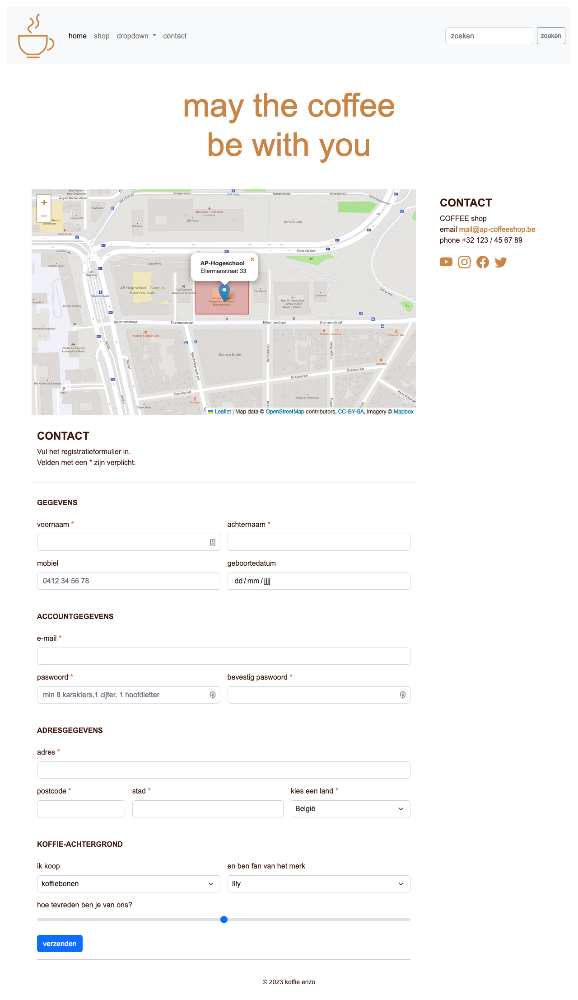
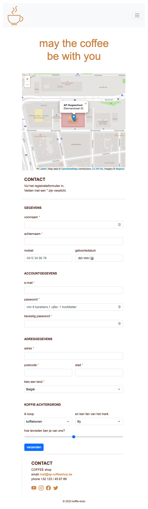
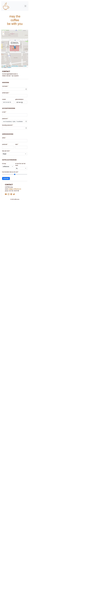

# 💻 09. JS-libraries > oefening 01

## 🛠️ opdrachten

### JS-library en API linken

Voeg (in het `<head>`-element) van `contact.html` de volgende bibliotheek en API-link toe:

 - [Leaflet](https://leafletjs.com/)

### Leaflet-library

In het `<main>`-element op `contact.html` is een `
`-element met `id="apMap"` voorzien. 

 - Zorg dat er in het div-element een kaart wordt getoond met behulp van `leaflet.js`.  
   Lees de documentatie van `leaflet.js` op https://leafletjs.com/.
 - Je linkt alle nodige bestanden in `contact.html` en schrijft jouw code in `js/mapScript.js`.
 - De map is `500px` hoog en `100%` breed (./css/mapStyle.css).
 - AP-Hogeschool ligt in de Ellermanstraat 33 op de coordinaten `[51.23009, 4.41616]`. Zet op deze plek een `marker`, zoom in op stand `17`.
 - Zorg ervoor dat de campus Ellerman wordt aangeduid met een *rood vierkant* op de kaart.
   **tip:** lees https://leafletjs.com/reference.html#rectangle  
    gebruik als bounds voor de rechthoek: `[51.23041, 4.4155]` en `[51.22991, 4.41675]`

