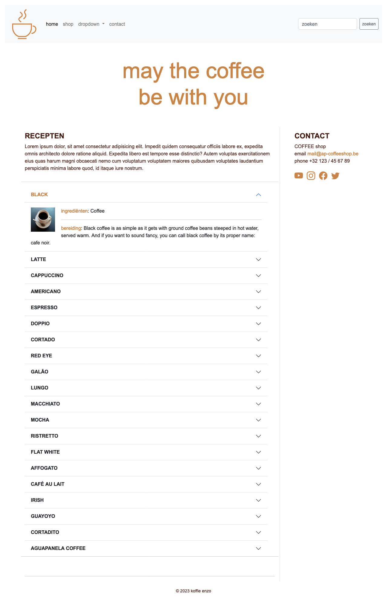
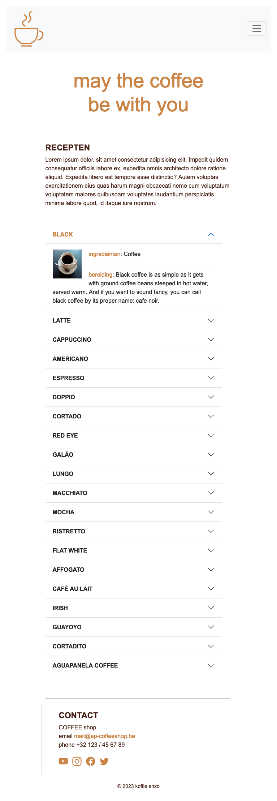
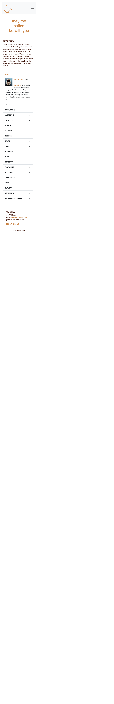

# 💻 09. JS-libraries > oefening 02

## 🛠️ opdrachten

### JS-libraries en API's linken

Voeg (in het `<head>`-element) van `recepten.html` de volgende bibliotheek en API-link toe:

 - [coffee-API](https://sampleapis.com/api-list/coffee)

### Coffee-library

In het `<main>`-element op `recepten.html` is een `<section>`-element met `id="recepten"` voorzien. 

 - [ ] Zorg dat er in het section-element een bootstrap accordion wordt getoond met 20 warme koffie-recepten met behulp van `js/script-recepten.js`.  
   **tip:**  `/?results=20`
 - [ ] Je linkt alle nodige bestanden in `contact.html` en schrijft jouw code in `js/script-recepten.js`.
 - [ ] Gebruik telkens de instructies in het startbestand.
 - [ ] Haal 2 welbepaalde stukken commentaar uit `script-recepten.js`  
   (zie instructies in js-document voor meer info)  
   **tip:** Gebruik ThunderClient of Postman en de coffee-API.
 - [ ] Maak voor de afbeelding van de recepten een klasse "img-small" aan.
 - [ ] Zorg dat deze een padding heeft van boven 0px, rechts 20px, onder 20px en links 0px.
 - [ ] De afbeelding is 100 px hoog en 100 px breed.
 - [ ] Voeg deze klasse nu toe aan de afbeelding in `script-recepten.js`
 - [ ] Zorg dat zowel de contactpagina als de receptenpagina naar elkaar
kunnen linken via de navigatie.

